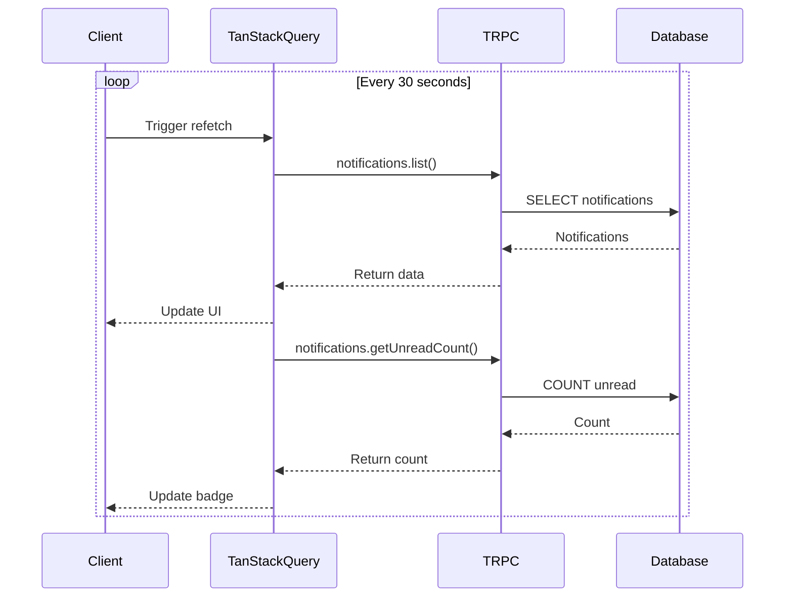
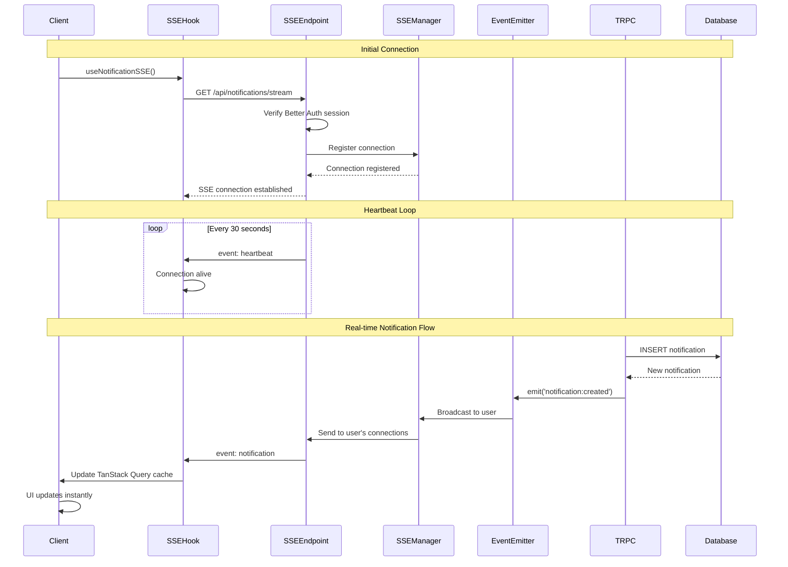
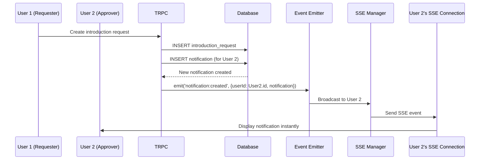
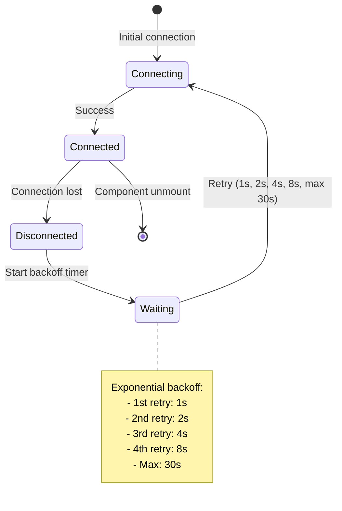
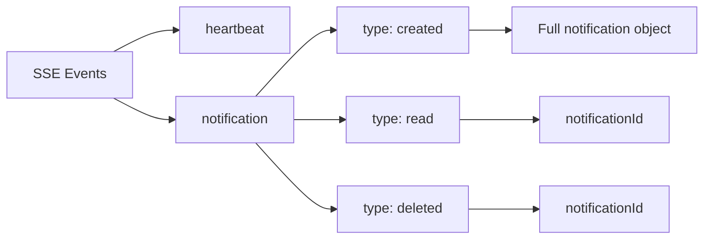
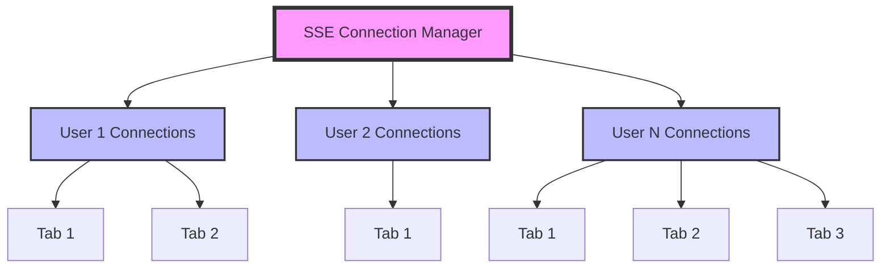

# SSE Architecture Diagram

## Current Polling Architecture



## New SSE Architecture



## Component Architecture

```mermaid
graph TB
    subgraph "Client Side"
        A[Notification.tsx] --> B[useNotifications Hook]
        B --> C[useNotificationSSE Hook]
        B --> D[TanStack Query]
        C --> E[EventSource API]
        E --> F[/api/notifications/stream]
    end

    subgraph "Server Side"
        F --> G[SSE Endpoint Handler]
        G --> H[Better Auth Session]
        G --> I[SSE Connection Manager]
        I --> J[Notification Event Emitter]

        K[TRPC Notification Router] --> L[Database]
        K --> J

        M[TRPC Introduction Router] --> L
        M --> J
    end

    J -.->|Real-time events| I
    I -.->|SSE messages| F
```

## Data Flow: Creating a Notification



## Reconnection Flow



## SSE Message Types



## Connection Management



## Benefits Comparison

| Aspect             | Polling (Current)               | SSE (New)                       |
| ------------------ | ------------------------------- | ------------------------------- |
| **Latency**        | Up to 30 seconds                | Instant (<100ms)                |
| **Server Load**    | High (constant requests)        | Low (persistent connections)    |
| **Bandwidth**      | High (repeated full responses)  | Low (only changes sent)         |
| **Scalability**    | Poor (N users × 2 requests/30s) | Good (N persistent connections) |
| **Battery Impact** | High (mobile devices)           | Low (single connection)         |
| **Real-time**      | No                              | Yes                             |
| **Complexity**     | Low                             | Medium                          |

## Key Implementation Details

### SSE Headers

```typescript
{
  'Content-Type': 'text/event-stream',
  'Cache-Control': 'no-cache',
  'Connection': 'keep-alive',
  'X-Accel-Buffering': 'no' // Disable nginx buffering
}
```

### SSE Message Format

```
event: notification
data: {"type":"created","notification":{...}}

event: heartbeat
data: {"timestamp":1234567890}
```

### EventSource Connection

```typescript
const eventSource = new EventSource('/api/notifications/stream', {
  withCredentials: true, // Include cookies for auth
})
```

### Exponential Backoff

```typescript
const delays = [1000, 2000, 4000, 8000, 16000, 30000]
const delay = delays[Math.min(retryCount, delays.length - 1)]
```
