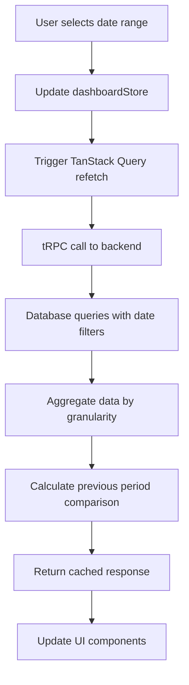

# Dashboard Implementation Plan

## Overview

Build a performant analytics dashboard for IntroHub that displays user statistics, introduction request metrics, and trends over customizable date ranges.

## Architecture

### 1. Backend (tRPC + Database)

#### 1.1 Database Schema (Already Exists)

- `contacts` - User's contact list
- `introductionRequests` - Introduction requests with status (pending/approved/declined)
- `user` - User information

#### 1.2 New tRPC Router: `dashboardRouter`

Location: `src/integrations/trpc/routes/dashboard.ts`

**Endpoints:**

- `getStats` - Get dashboard statistics for date range
- `getTrendData` - Get time-series data for charts
- `getTopContacts` - Get contacts ranked by request count

**Query Parameters:**

- `startDate: Date` - Start of date range
- `endDate: Date` - End of date range
- `granularity?: 'daily' | 'weekly' | 'monthly'` - Auto-calculated if not provided

#### 1.3 Zod Schemas

Location: `src/schemas/dashboard.schema.ts`

```typescript
- dashboardQuerySchema - Input validation for date ranges
- dashboardStatsSchema - Response type for statistics
- trendDataPointSchema - Single data point in time series
- topContactSchema - Contact with request count
```

### 2. Frontend Architecture

#### 2.1 State Management

Location: `src/routes/_authenticated/(dashboard)/-store/dashboardStore.ts`

**State:**

```typescript
{
  dateRange: { start: Date, end: Date }
  preset: 'last7' | 'last30' | 'last90' | 'thisMonth' | 'custom'
  granularity: 'daily' | 'weekly' | 'monthly'
}
```

#### 2.2 Custom Hooks

Location: `src/routes/_authenticated/(dashboard)/-hooks/`

**Hooks:**

- `useDashboardStats.tsx` - Fetch statistics with TanStack Query
- `useDashboardTrends.tsx` - Fetch trend data
- `useTopContacts.tsx` - Fetch top contacts
- `useDateRangePresets.tsx` - Manage date range presets

**Caching Strategy:**

```typescript
{
  staleTime: 5 * 60 * 1000, // 5 minutes
  gcTime: 10 * 60 * 1000,   // 10 minutes
  refetchOnWindowFocus: false
}
```

#### 2.3 Components

##### Core Components

Location: `src/routes/_authenticated/(dashboard)/-components/`

1. **DateRangeSelector.tsx**
   - Preset buttons (Last 7/30/90 days, This month)
   - Custom date range picker
   - Updates store on change

2. **StatCard.tsx**
   - Display metric value
   - Show percentage change vs previous period
   - Color-coded (green for positive, red for negative)
   - Icon support

3. **TrendChart.tsx**
   - Wraps Chart.tsx component
   - Line/Area chart for time-series data
   - Multiple series support (requests made/received)
   - Responsive sizing

4. **StatusDonutChart.tsx**
   - Donut chart showing request status breakdown
   - Legend with percentages
   - Color-coded by status

5. **TopContactsTable.tsx**
   - Table showing top contacts by request count
   - Sortable columns
   - Export button

6. **DashboardHeader.tsx**
   - Page title and description
   - Date range selector
   - Export all data button

#### 2.4 Page Layout

Location: `src/routes/_authenticated/dashboard.tsx`

**Layout Structure:**

```
┌─────────────────────────────────────────┐
│ DashboardHeader (Title + DateSelector)  │
├─────────────────────────────────────────┤
│ Masonry Layout (Stat Cards)             │
│ ┌──────┐ ┌──────┐ ┌──────┐ ┌──────┐   │
│ │ Card │ │ Card │ │ Card │ │ Card │   │
│ └──────┘ └──────┘ └──────┘ └──────┘   │
├─────────────────────────────────────────┤
│ TrendChart (Full Width)                 │
├─────────────────────────────────────────┤
│ Grid Layout (2 columns on desktop)      │
│ ┌──────────────┐ ┌──────────────┐     │
│ │ StatusDonut  │ │ TopContacts  │     │
│ │   Chart      │ │    Table     │     │
│ └──────────────┘ └──────────────┘     │
└─────────────────────────────────────────┘
```

### 3. Data Flow



### 4. Metrics Calculation

#### 4.1 Core Metrics

1. **Total Contacts** - Count of user's contacts
2. **Requests Made** - Count where user is requester
3. **Requests Received** - Count where user is approver
4. **Approval Rate** - (approved / total received) \* 100
5. **Rejection Rate** - (declined / total received) \* 100
6. **Average Response Time** - Average time between request creation and approval/rejection
   - Only calculated for non-pending requests (status = 'approved' or 'declined')
   - Formula: `AVG(updatedAt - createdAt)` for status != 'pending'
   - Display format: "X days Y hours" or "X hours" for < 24h
   - Separate calculations for:
     - Requests you received (as approver) - your response time
     - Requests you made (as requester) - others' response time to you

#### 4.2 Previous Period Comparison

- Calculate same metrics for previous period (same duration)
- Compute percentage change: `((current - previous) / previous) * 100`

#### 4.3 Time-Series Aggregation

**Smart Granularity:**

- Range < 30 days → Daily aggregation
- Range 30-90 days → Weekly aggregation
- Range > 90 days → Monthly aggregation

**SQL Aggregation:**

```sql
-- Daily example
SELECT
  DATE(created_at) as date,
  COUNT(*) as count,
  status
FROM introduction_requests
WHERE created_at BETWEEN ? AND ?
GROUP BY DATE(created_at), status
ORDER BY date

-- Average response time
SELECT
  AVG(EXTRACT(EPOCH FROM (updated_at - created_at))) as avg_seconds
FROM introduction_requests
WHERE status != 'pending'
  AND created_at BETWEEN ? AND ?
  AND (approver_id = ? OR requester_id = ?)
```

### 5. Performance Optimizations

#### 5.1 Database

- Add indexes on `created_at` columns
- Use date range filters in WHERE clauses
- Limit result sets appropriately

#### 5.2 Frontend

- TanStack Query caching (5 min stale time)
- Debounce date range changes (500ms)
- Lazy load chart libraries
- Memoize expensive calculations
- Use React.Suspense for loading states

#### 5.3 API

- Return only necessary fields
- Pre-aggregate data on server
- Use tRPC batching for multiple queries

### 6. File Structure

```
src/
├── routes/
│   └── _authenticated/
│       └── (dashboard)/
│           ├── dashboard.tsx (main page)
│           ├── -components/
│           │   ├── DateRangeSelector.tsx
│           │   ├── StatCard.tsx
│           │   ├── TrendChart.tsx
│           │   ├── StatusDonutChart.tsx
│           │   ├── TopContactsTable.tsx
│           │   └── DashboardHeader.tsx
│           ├── -hooks/
│           │   ├── useDashboardStats.tsx
│           │   ├── useDashboardTrends.tsx
│           │   ├── useTopContacts.tsx
│           │   └── useDateRangePresets.tsx
│           └── -store/
│               └── dashboardStore.ts
├── integrations/
│   └── trpc/
│       └── routes/
│           └── dashboard.ts (new router)
└── schemas/
    └── dashboard.schema.ts (new schemas)
```

### 7. Implementation Order

1. **Backend First** (Tasks 1-5)
   - Create schemas
   - Build tRPC router
   - Implement database queries
   - Add aggregation logic
   - Test with sample data

2. **State & Hooks** (Tasks 6-7)
   - Create Zustand store
   - Build custom hooks with TanStack Query
   - Test data fetching

3. **Components** (Tasks 8-12)
   - Build reusable components
   - Test individually with mock data
   - Integrate with real data

4. **Page Assembly** (Task 13)
   - Compose components into dashboard
   - Implement Masonry layout
   - Add responsive breakpoints

5. **Polish** (Tasks 14-18)
   - Add loading/error states
   - Optimize caching
   - Add export functionality
   - Performance testing
   - Mobile optimization

### 8. Testing Strategy

#### 8.1 Backend Tests

- Test date range filtering
- Verify aggregation accuracy
- Test edge cases (no data, single day, etc.)

#### 8.2 Frontend Tests

- Component unit tests
- Hook tests with mock data
- Integration tests for data flow

#### 8.3 Performance Tests

- Measure query execution time
- Test with large datasets
- Monitor cache hit rates

### 9. Export Functionality

**Export Options:**

- CSV export for all dashboard data
- PDF export for visual report
- Date range included in export

**Implementation:**

- Use `papaparse` for CSV generation
- Use `jspdf` + `html2canvas` for PDF
- Server-side generation for large datasets

### 10. Responsive Design

**Breakpoints:**

- Mobile (< 768px): Single column, stacked cards
- Tablet (768px - 1024px): 2 columns for stat cards
- Desktop (> 1024px): Masonry layout with 3-4 columns

**Mobile Optimizations:**

- Simplified charts (fewer data points)
- Collapsible sections
- Touch-friendly date picker
- Horizontal scroll for tables

## Next Steps

Once this plan is approved, we'll switch to Code mode to implement each task sequentially, ensuring:

- Type safety with TypeScript and Zod
- Performance with proper caching
- Clean, maintainable code
- Comprehensive error handling
