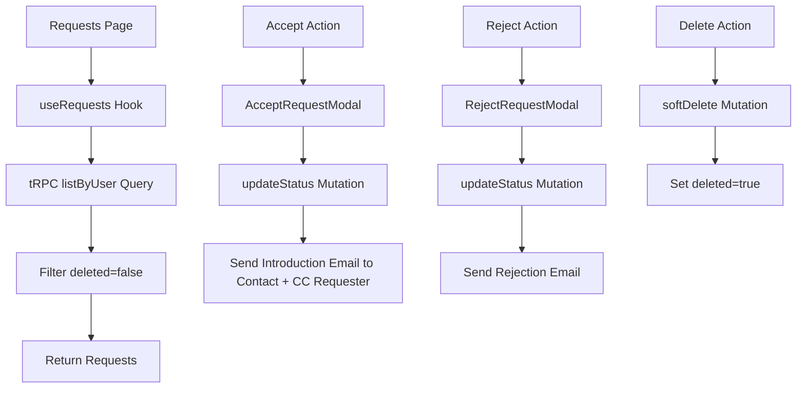

# Requests Page Implementation Plan

## Overview

Build a requests page that displays all introduction requests for the current user (where they are the approver). Users can accept, reject, or soft-delete requests. The page follows the same layout pattern as contacts and search pages with a data table.

**Key Change**: When accepting a request, the system sends a single introduction email to BOTH the requester and the contact (using contact's email in TO field), introducing them to each other.

## Architecture Decisions

### 1. Database Schema Changes

- Add `deleted` boolean field to `introductionRequests` table (default: false)
- Filter deleted requests on the backend (completely hidden from UI)
- No permanent delete - only soft delete functionality

### 2. Component Structure

```
src/routes/_authenticated/(requests)/
├── requests.tsx                          # Main route component
├── -components/
│   ├── RequestsTable.tsx                 # Data table with requests
│   ├── RequestsTableTools.tsx            # Search and filter tools
│   ├── RequestsActionTools.tsx           # Top-level actions
│   ├── AcceptRequestModal.tsx            # NEW: Accept with email template
│   └── RejectRequestModal.tsx            # NEW: Reject with email template
├── -hooks/
│   └── useRequests.tsx                   # Request management hook
└── -store/
    └── requestStore.ts                   # Request state management
```

### 3. Email Template Strategy

- **Accept Modal**: Creates introduction email sent to BOTH requester and contact
  - TO: Contact's email address
  - CC: Requester's email address
  - Template introduces both parties to each other
  - User can add custom introduction message
- **Reject Modal**: Pre-fill with rejection template sent only to requester
  - Both modals allow editing custom message only (not the entire email)

### 4. Data Flow



## Implementation Steps

### Phase 1: Database & Schema Updates

#### 1.1 Update Database Schema

**File**: `src/db/schema.ts`

- Add `deleted` field to `introductionRequests` table

```typescript
deleted: boolean('deleted').default(false).notNull(),
```

#### 1.2 Create Migration

**Command**: `pnpm drizzle-kit generate`

- Generate migration file for schema changes
- Review migration SQL
- Run migration: `pnpm drizzle-kit migrate`

#### 1.3 Update Zod Schemas

**File**: `src/schemas/introduction-request.schema.ts`

- Add `deleted` field to base schema
- Update type exports

### Phase 2: Backend Updates

#### 2.1 Update tRPC Router

**File**: `src/integrations/trpc/routes/introduction-request.ts`

**Changes**:

1. Update `listByUser` query to filter `deleted = false`
2. Add `softDelete` mutation:

```typescript
softDelete: protectedProcedure
  .input(z.object({ id: z.number() }))
  .mutation(async ({ input, ctx }) => {
    // Verify user is approver
    // Update deleted = true
    // Return success
  })
```

3. Ensure `listByUser` returns all necessary fields:
   - Request details (id, message, status, createdAt, updatedAt)
   - Requester info (name, email, company, position)
   - Target contact info (name, email, company, position)
   - Response message (if exists)

### Phase 3: Frontend - State Management

#### 3.1 Create Request Store

**File**: `src/routes/_authenticated/(requests)/-store/requestStore.ts`

**State**:

```typescript
interface RequestStore {
  selectedRequests: IntroductionRequest[]
  setSelectedRequest: (checked: boolean, request: IntroductionRequest) => void
  setSelectAllRequests: (requests: IntroductionRequest[]) => void
}
```

#### 3.2 Create useRequests Hook

**File**: `src/routes/_authenticated/(requests)/-hooks/useRequests.tsx`

**Features**:

- Fetch requests with `listByUser` query
- Accept request mutation (calls `updateStatus` with 'approved')
- Reject request mutation (calls `updateStatus` with 'declined')
- Soft delete mutation
- Optimistic updates
- Toast notifications
- Error handling

### Phase 4: Frontend - Components

#### 4.1 Main Route Component

**File**: `src/routes/_authenticated/(requests)/requests.tsx`

**Structure**:

```typescript
- Container with AdaptiveCard
- Header with title "Introduction Requests"
- RequestsTableTools (search/filter)
- RequestsTable (data display)
- AcceptRequestModal
- RejectRequestModal
- ConfirmationDialog (for delete)
```

#### 4.2 Requests Table

**File**: `src/routes/_authenticated/(requests)/-components/RequestsTable.tsx`

**Columns**:

1. Requester (avatar + name)
2. Contact (who they want to meet)
3. Company (requester's company)
4. Status (badge: pending/approved/declined)
5. Date (when request was made)
6. Actions (accept/reject/delete buttons)

**Features**:

- Selectable rows
- Pagination
- Sorting
- Loading states
- Empty state

#### 4.3 Accept Request Modal

**File**: `src/routes/_authenticated/(requests)/-components/AcceptRequestModal.tsx`

**Email Flow**:

- TO: Contact's email address
- CC: Requester's email address
- Introduces both parties to each other

**Template Structure**:

```
Subject: Introduction: [Requester Name] <> [Contact Name]

Hi [Contact Name] and [Requester Name],

I'd like to introduce you both!

[Contact Name] - [Contact Position] at [Contact Company]
[Contact Email]

[Requester Name] - [Requester Position] at [Requester Company]
[Requester Email]

[Custom Introduction Message - Editable by User]

I think you both would benefit from connecting. Please feel free to take it from here!

Best regards,
[Current User Name]
```

**Features**:

- Pre-filled introduction template with both parties' details
- Editable custom introduction message section
- Shows preview of who will receive the email (TO: Contact, CC: Requester)
- Character count (max 5000)
- Form validation with Zod
- Submit button with loading state

#### 4.4 Reject Request Modal

**File**: `src/routes/_authenticated/(requests)/-components/RejectRequestModal.tsx`

**Template Structure**:

```
Subject: Re: Introduction Request

Hi [Requester Name],

Thank you for your interest in connecting with [Contact Name].

[Custom Message - Editable by User]

I appreciate your understanding.

Best regards,
[Current User Name]
```

**Features**:

- Pre-filled template
- Editable custom message section
- Character count (max 5000)
- Form validation with Zod
- Submit button with loading state

#### 4.5 Table Tools

**File**: `src/routes/_authenticated/(requests)/-components/RequestsTableTools.tsx`

**Features**:

- Search input (filter by requester name, contact name, company)
- Status filter dropdown (All/Pending/Approved/Declined)
- Batch actions (if multiple selected)

#### 4.6 Action Tools

**File**: `src/routes/_authenticated/(requests)/-components/RequestsActionTools.tsx`

**Features**:

- Refresh button
- Export button (optional)
- Help/info button

### Phase 5: Backend Email Service Updates

#### 5.1 Create New Email Schema

**File**: `src/schemas/email.schema.ts`

Add new schema for introduction email:

```typescript
export const introductionEmailSchema = z.object({
  to: z.string().email(), // Contact's email
  cc: z.string().email(), // Requester's email
  approverName: z.string(),
  requesterName: z.string(),
  requesterEmail: z.string().email(),
  requesterCompany: z.string().nullable().optional(),
  requesterPosition: z.string().nullable().optional(),
  contactName: z.string(),
  contactEmail: z.string().email(),
  contactCompany: z.string().nullable().optional(),
  contactPosition: z.string().nullable().optional(),
  customMessage: z.string(),
  from: z.string().email().optional(),
})
```

#### 5.2 Create Email Service Function

**File**: `src/services/email.functions.ts`

Add new function:

```typescript
export async function sendIntroductionEmail(data: IntroductionEmail) {
  // Send email to contact with requester CC'd
  // Include both parties' information
  // Include custom introduction message
}
```

#### 5.3 Update tRPC Router

**File**: `src/integrations/trpc/routes/introduction-request.ts`

Update `updateStatus` mutation for 'approved' status:

- Call new `sendIntroductionEmail` function instead of `sendIntroductionResponseEmail`
- Pass contact email as TO
- Pass requester email as CC
- Include both parties' details
- Include custom message from modal

### Phase 6: Integration & Testing

#### 6.1 Route Registration

- Ensure route is registered in TanStack Router
- Add to navigation menu if needed
- Set up proper authentication guards

#### 6.2 Testing Checklist

- [ ] View all pending requests
- [ ] Accept request with custom introduction message
- [ ] Verify introduction email sent to contact (TO) and requester (CC)
- [ ] Verify email includes both parties' information
- [ ] Reject request with custom message
- [ ] Verify rejection email sent only to requester
- [ ] Soft delete request
- [ ] Verify deleted requests don't appear
- [ ] Search/filter functionality
- [ ] Pagination works correctly
- [ ] Loading states display properly
- [ ] Error handling works
- [ ] Optimistic updates work
- [ ] Toast notifications appear
- [ ] Mobile responsive design

## Key Considerations

### Security

- Only approvers can see requests where they are the approver
- Verify user permissions in all mutations
- Sanitize email content before sending

### Performance

- Use pagination for large request lists
- Implement optimistic updates for better UX
- Cache query results appropriately

### UX

- Clear status indicators (badges with colors)
- Confirmation dialogs for destructive actions
- Loading states during async operations
- Success/error toast notifications
- Empty states with helpful messages

### Email Templates

- Keep templates professional and clear
- Include all necessary contact information
- Allow personalization through custom message
- Ensure proper formatting in emails

## File Dependencies

### Existing Files to Reference

- `src/routes/_authenticated/(contacts)/contacts.tsx` - Layout pattern
- `src/routes/_authenticated/(contacts)/-components/ContactListTable.tsx` - Table structure
- `src/routes/_authenticated/(search)/-components/IntroductionRequestModal.tsx` - Modal pattern
- `src/integrations/trpc/routes/introduction-request.ts` - Backend logic
- `src/schemas/introduction-request.schema.ts` - Validation schemas

### New Files to Create

1. `src/routes/_authenticated/(requests)/requests.tsx`
2. `src/routes/_authenticated/(requests)/-components/RequestsTable.tsx`
3. `src/routes/_authenticated/(requests)/-components/RequestsTableTools.tsx`
4. `src/routes/_authenticated/(requests)/-components/RequestsActionTools.tsx`
5. `src/routes/_authenticated/(requests)/-components/AcceptRequestModal.tsx`
6. `src/routes/_authenticated/(requests)/-components/RejectRequestModal.tsx`
7. `src/routes/_authenticated/(requests)/-hooks/useRequests.tsx`
8. `src/routes/_authenticated/(requests)/-store/requestStore.ts`

## Success Criteria

✅ Users can view all their pending introduction requests
✅ Users can accept requests with custom messages
✅ Contact details are automatically included in acceptance emails
✅ Users can reject requests with custom messages
✅ Users can soft-delete requests (hidden from view)
✅ Deleted requests are filtered on the backend
✅ All actions have proper loading and error states
✅ Email notifications are sent for all actions
✅ Page follows existing design patterns
✅ Mobile responsive design
✅ Proper error handling throughout

## Next Steps

After plan approval:

1. Switch to Code mode
2. Implement changes in order of todo list
3. Test each feature as it's completed
4. Verify email templates work correctly
5. Ensure proper error handling
6. Test edge cases
